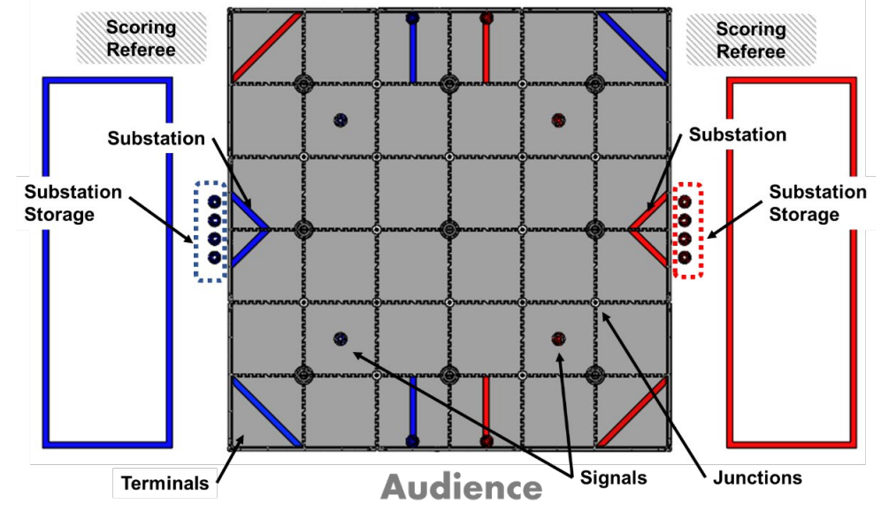

# RoPlot

**Deprecated** Switched over to the [ACME Robotics dashboard extension](https://acmerobotics.github.io/ftc-dashboard/). It's far more functional.

A tool for graphing and/or animating robot motion in matches. 

This tool is developed as a framework that solves some of the key issues around logging 
and realtime / playback of locations.

## Field Setup

The source of this description is the [Field Setup Guide](https://firstinspiresst01.blob.core.windows.net/first-energize-ftc/field-setup-and-assembly-guide.pdf).

* Each tile is 24 inches squared 
* Total field is six tiles across
* Origin (0,0) is at the blue / audience corner
* Positive x points from the blue side to the red side
* Positive y points from the audience to the back

## Future Work

Check out the 
[TimestampedGeoJson](https://python-visualization.github.io/folium/plugins.html#:~:text=class%20folium.plugins.TimestampedGeoJson) 
as a potential way to 
[animate GeoJson](https://medium.com/@mcmanus_data_works/create-animated-maps-with-folium-e122b5e99afb)https://neo4j.com/blog/this-week-in-neo4j-nodes-session-recordings-connection-in-large-data-sets-graph-ml-systems-next-js-graph-embeddings-bitcoin-and-more/?utm_campaign=Twin4j&utm_content=UI&utm_medium=social&utm_source=Twitter&utm_tag=&utm_term=Image#:~:text=MACHINE%20LEARNING%3A%206%20Steps%20to%20Activate%20the%20Value%20of%20Text%20to%20Graph%20Machine%20Learning%20Systems